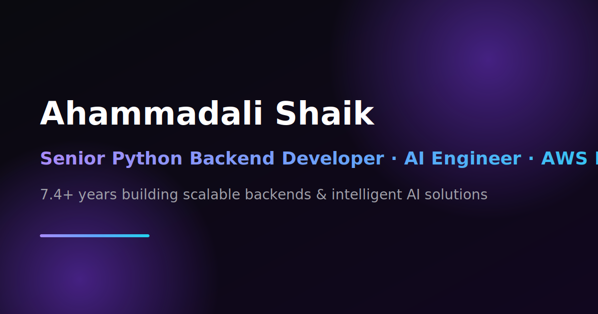

# Ahammadali Shaik — Portfolio

A premium, production-ready personal portfolio for **Ahammadali Shaik** — Senior Python Backend Developer, AI Engineer & AWS Developer. Designed to feel modern, futuristic, and enterprise-grade, taking cues from Apple, Stripe, Vercel, Linear, and Raycast.



## ✨ Features

- **Dark, glassmorphism design** with animated gradients and glowing borders
- **Animated particle constellation** background (canvas, perf-aware)
- **Custom cursor glow** with magnetic interactive elements
- **Floating gradient orbs** + grid backdrop
- **Scroll progress** indicator and smooth scrolling
- **Branded loading screen** intro
- **Animated stat counters**, **typewriter** hero text
- **3D spotlight cards** with cursor-tracking glow + tilt
- Full sections: Hero, About, Skills, Experience (vertical timeline), Featured Projects, Achievements, Certifications, Contact
- Fully **responsive** and **accessible** (respects `prefers-reduced-motion`)
- **SEO**: metadata, OpenGraph/Twitter cards, JSON-LD, sitemap & robots

## 🧱 Tech Stack

- [Next.js 15](https://nextjs.org) (App Router) + React 19
- TypeScript
- Tailwind CSS + `tailwindcss-animate`
- Framer Motion
- Shadcn-style UI primitives (self-contained, no Radix dependency)
- Lucide Icons

## 🚀 Getting Started

```bash
# install dependencies
npm install

# run the dev server
npm run dev

# build for production
npm run build && npm start
```

Open [http://localhost:3000](http://localhost:3000).

## 📁 Project Structure

```
src/
├── app/
│   ├── layout.tsx        # Root layout, fonts, global effects, SEO metadata
│   ├── page.tsx          # Home page (assembles all sections) + JSON-LD
│   ├── globals.css       # Design system, glass/gradient utilities
│   ├── sitemap.ts        # Generated sitemap.xml
│   └── robots.ts         # Generated robots.txt
├── components/
│   ├── effects/          # particles, cursor glow, orbs, scroll progress,
│   │                     # loading screen, counters, typewriter,
│   │                     # magnetic, spotlight-card
│   ├── layout/           # navbar, footer
│   ├── sections/         # hero, about, skills, experience, projects,
│   │                     # achievements, certifications, contact
│   └── ui/               # button, card, badge, input, textarea,
│                         # reveal, section-heading, slot
└── lib/
    ├── data.ts           # ← single source of truth for ALL content
    └── utils.ts          # cn() class merger
```

## ✏️ Customizing Content

All copy lives in [`src/lib/data.ts`](./src/lib/data.ts) — edit `PERSONAL`, `STATS`,
`SKILL_CATEGORIES`, `EXPERIENCE`, `PROJECTS`, `ACHIEVEMENTS`, and `CERTIFICATIONS`
to update the entire site. Replace `public/resume.pdf` with your real resume and
swap `SITE_URL` in `data.ts` for your production domain.

## ☁️ Deploy

Optimized for [Vercel](https://vercel.com) — push to GitHub and import the repo.
Set the production domain in `src/lib/data.ts` (`SITE_URL`) so SEO tags and the
sitemap point to the right place.

---

Built with Next.js, Tailwind & Framer Motion.
